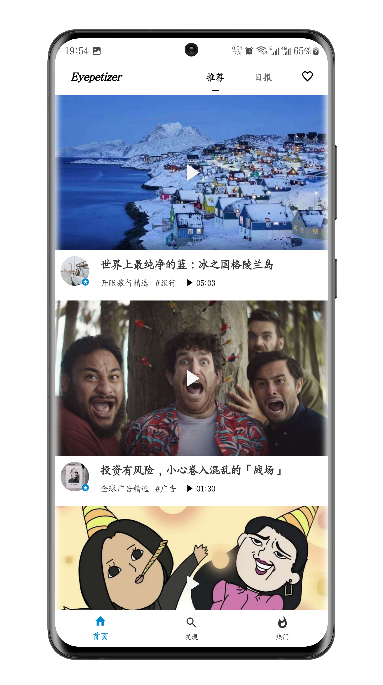
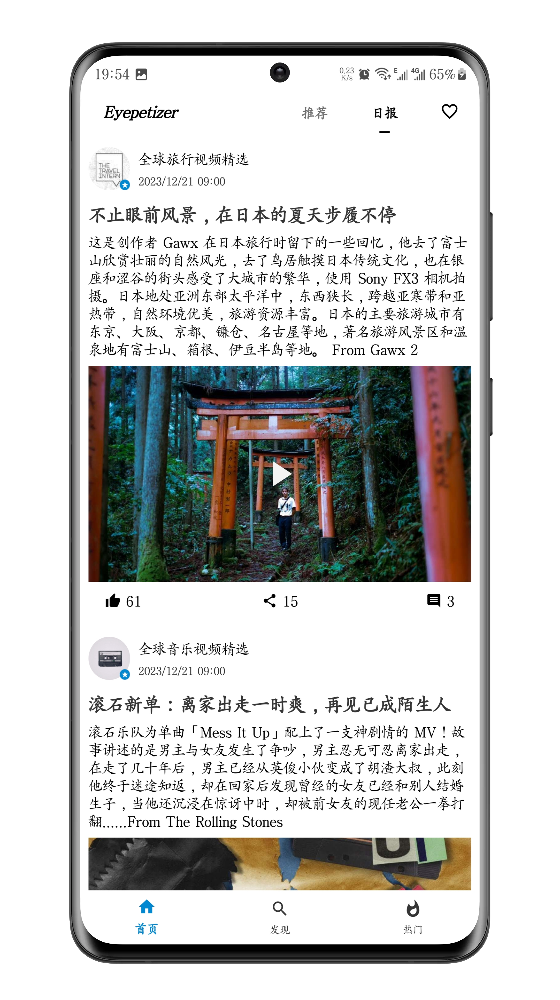
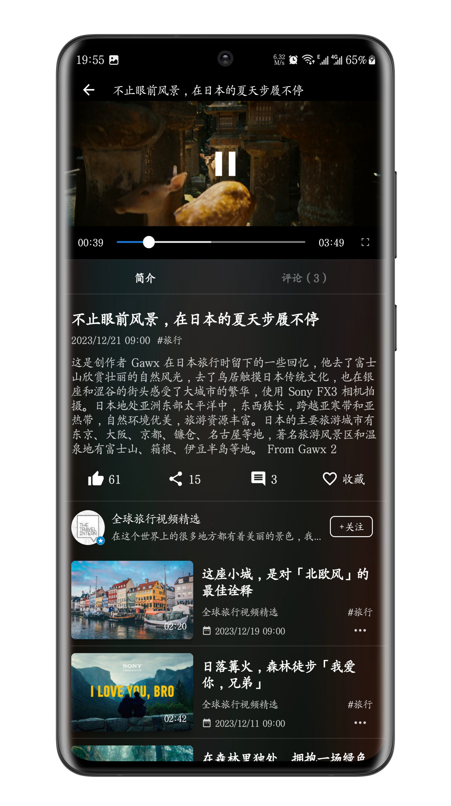
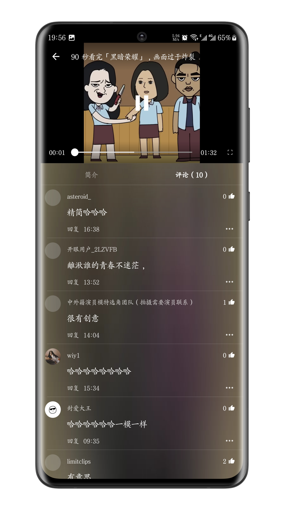
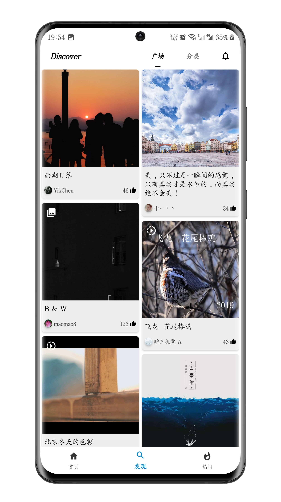
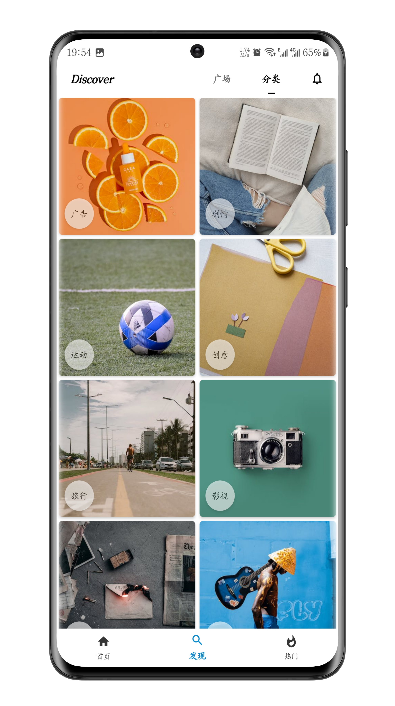
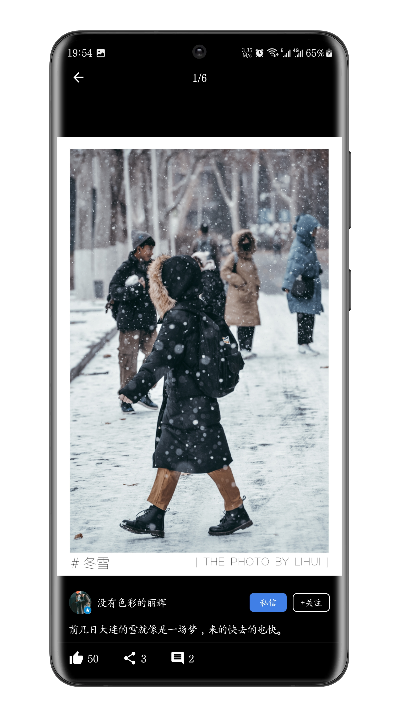
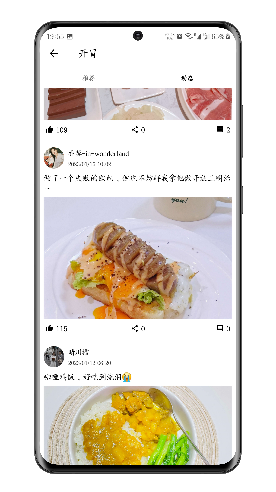
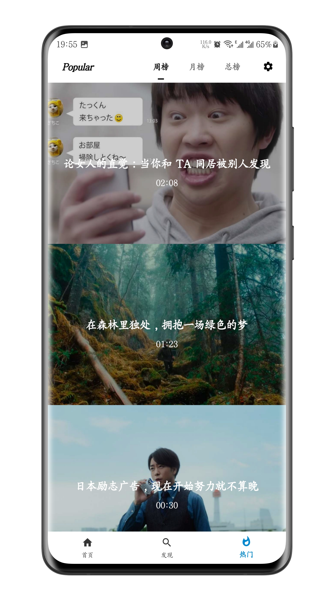
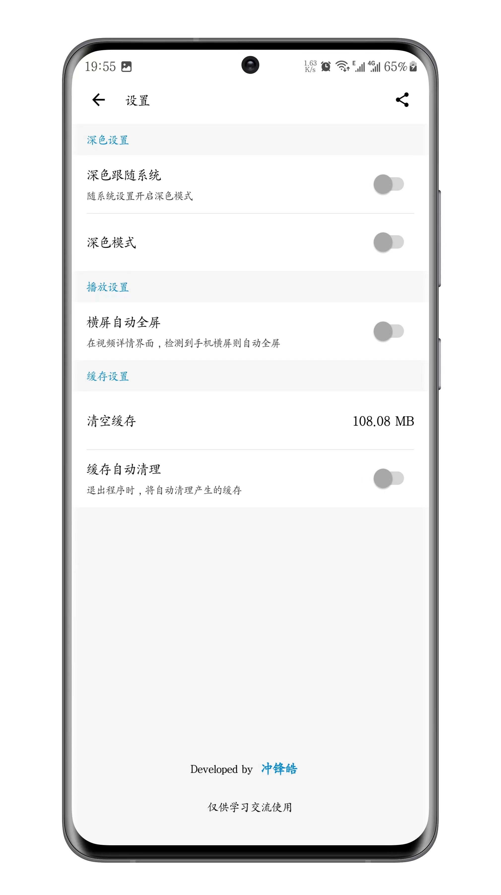

English | [中文](README.md)

# KaiYan
[][20]
[][21]
[][22]

## Project Introduction
The project imitates the [Eyepetizer app][18], which mainly involves video playback, page loading, database management, and more. The main purpose of doing this project is to improve one's proficiency in Kotlin and JetPack. The application interface is simple, and the code is relatively easy to understand. The coding should refer to the [official Kotlin documentation][1] as much as possible. If the source code of the project is helpful to you, **Star** can support it. Thank you very much! In addition, if you are interested in this project, please participate in discussions and contribute code to jointly promote the development and improvement of the project!

## Functionality
- Gathering high-quality short video content from around the world to broaden your horizons.
- View community graphics, videos, and comments to inspire your life.

## Application Architecture
MVVM

## Involving technology
- [Kotlin][1] development language
- [Retrofit][2]、[OkHttp][3] Network request encapsulation
- [Flow][4]、[Coroutines][5]、[Paging3][6]、[Room][7]、[MMKV][8] Asynchronous Programming and Data Processing
- [Glide][9]、[PhotoView][10]、[GSYVideoPlayer][11] Image and video processing
- [ViewModel][12]、[Livedata][13]、[Lottie][14]、[Shimmerlayout][15]、[Immersionbar][16]、[SmartRefreshLayout][17] Interface interaction and others

## Application screenshot





## Application download


Scan the QR code or[Click me to download][19]

## License
All data in this application is sourced from OpenEye and is for learning and communication purposes only. It is strictly prohibited to use it for any commercial purposes. Please respect the rights and interests of the original company and comply with relevant laws and regulations. If you intend to use this data for commercial purposes, please contact the original company and obtain their explicit authorization.
```
Copyright [2023] [leihaogit] <leihao168888@gmail.com>

   Licensed under the Apache License, Version 2.0 (the "License");
   you may not use this file except in compliance with the License.
   You may obtain a copy of the License at

       http://www.apache.org/licenses/LICENSE-2.0

   Unless required by applicable law or agreed to in writing, software
   distributed under the License is distributed on an "AS IS" BASIS,
   WITHOUT WARRANTIES OR CONDITIONS OF ANY KIND, either express or implied.
   See the License for the specific language governing permissions and
   limitations under the License.
```

[1]:https://www.kotlincn.net
[2]:https://github.com/square/retrofit
[3]:https://github.com/square/okhttp
[4]:https://developer.android.google.cn/reference/androidx/constraintlayout/core/widgets/Flow?hl=en
[5]:https://github.com/Kotlin/kotlinx.coroutines
[6]:https://developer.android.google.cn/topic/libraries/architecture/paging/v3-overview
[7]:https://developer.android.google.cn/jetpack/androidx/releases/room?hl=en
[8]:https://github.com/Tencent/MMKV
[9]:https://github.com/bumptech/glide
[10]:https://github.com/Baseflow/PhotoView
[11]:https://github.com/CarGuo/GSYVideoPlayer
[12]:https://developer.android.google.cn/topic/libraries/architecture/viewmodel?hl=en
[13]:https://developer.android.google.cn/topic/libraries/architecture/livedata?hl=en
[14]:https://github.com/airbnb/lottie-android
[15]:https://github.com/team-supercharge/ShimmerLayout
[16]:https://github.com/gyf-dev/ImmersionBar
[17]:https://github.com/scwang90/SmartRefreshLayout
[18]:https://home.eyepetizer.net/
[19]:https://www.pgyer.com/halkaiyan
[20]:https://opensource.org/licenses/Apache-2.0
[21]:https://android-arsenal.com/api?level=26
[22]:https://github.com/leihaogit