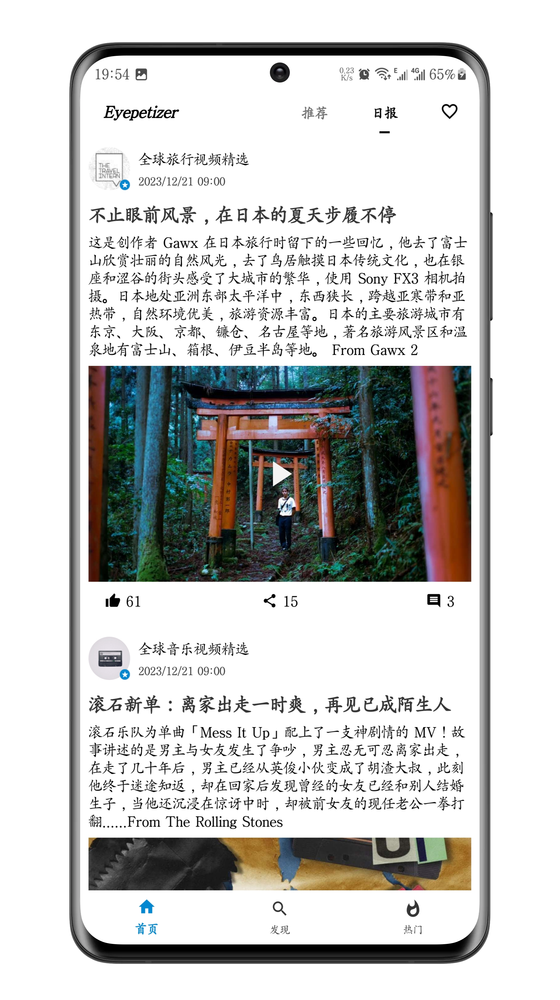
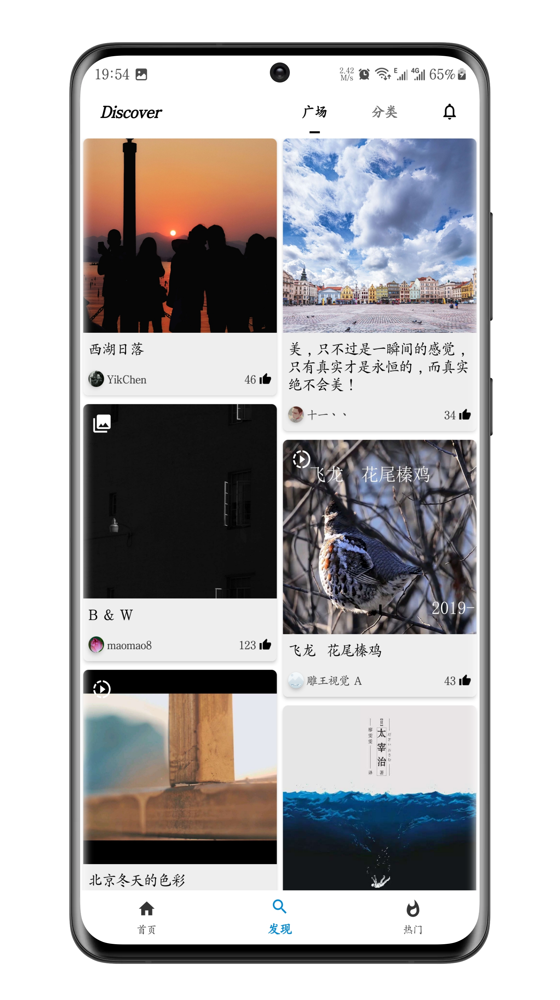

中文 | [English](README-en.md)

# KaiYan
[][1]
[][20]
[][21]
[][22]

## 项目简介
项目模仿[开眼 APP][18]，主要涉及到视频播放、分页加载、数据库管理等。做这个项目主要是为了提高自己的 Kotlin 和 JetPack 熟练度，应用界面简洁，代码也比较容易理解，编码都尽量参照[ Kotlin 官方文档][1]进行。如果项目的源码对您有所帮助，可以**Star**支持一下，非常感谢！另外，如果您对该项目感兴趣，欢迎参与讨论和贡献代码，共同促进项目的发展和完善！

## 应用功能
- 汇聚全球优质短视频内容，让你大开眼界。
- 查看社区图文视频及评论，启迪你的生活灵感。

## 应用架构
MVVM

## 涉及技术
- [Kotlin][1] 开发语言
- [Retrofit][2]、[OkHttp][3] 网络请求封装
- [Flow][4]、[Coroutines][5]、[Paging3][6]、[Room][7]、[MMKV][8] 异步编程与数据处理
- [Glide][9]、[PhotoView][10]、[GSYVideoPlayer][11] 图片视频处理
- [ViewModel][12]、[Livedata][13]、[Lottie][14]、[Shimmerlayout][15]、[Immersionbar][16]、[SmartRefreshLayout][17] 界面交互与其他

## 应用截图




## 下载安装


扫描二维码或者[点我下载][19]

## License
本应用所有数据均来源于开眼，仅供学习和交流使用，严禁用于任何商业用途。请务必尊重原作公司的权益，并遵守相关法律法规。如果您有意使用这些数据进行商业用途，请与原作公司联系并获得他们的明确授权。
```
Copyright (c) 2023 leihaogit <leihao168888@gmail.com>

   Licensed under the Apache License, Version 2.0 (the "License");
   you may not use this file except in compliance with the License.
   You may obtain a copy of the License at

       http://www.apache.org/licenses/LICENSE-2.0

   Unless required by applicable law or agreed to in writing, software
   distributed under the License is distributed on an "AS IS" BASIS,
   WITHOUT WARRANTIES OR CONDITIONS OF ANY KIND, either express or implied.
   See the License for the specific language governing permissions and
   limitations under the License.
```

[1]:https://www.kotlincn.net
[2]:https://github.com/square/retrofit
[3]:https://github.com/square/okhttp
[4]:https://developer.android.google.cn/reference/androidx/constraintlayout/core/widgets/Flow?hl=en
[5]:https://github.com/Kotlin/kotlinx.coroutines
[6]:https://developer.android.google.cn/topic/libraries/architecture/paging/v3-overview
[7]:https://developer.android.google.cn/jetpack/androidx/releases/room?hl=en
[8]:https://github.com/Tencent/MMKV
[9]:https://github.com/bumptech/glide
[10]:https://github.com/Baseflow/PhotoView
[11]:https://github.com/CarGuo/GSYVideoPlayer
[12]:https://developer.android.google.cn/topic/libraries/architecture/viewmodel?hl=en
[13]:https://developer.android.google.cn/topic/libraries/architecture/livedata?hl=en
[14]:https://github.com/airbnb/lottie-android
[15]:https://github.com/team-supercharge/ShimmerLayout
[16]:https://github.com/gyf-dev/ImmersionBar
[17]:https://github.com/scwang90/SmartRefreshLayout
[18]:https://home.eyepetizer.net/
[19]:https://www.pgyer.com/halkaiyan
[20]:https://opensource.org/licenses/Apache-2.0
[21]:https://android-arsenal.com/api?level=26
[22]:https://github.com/leihaogit
